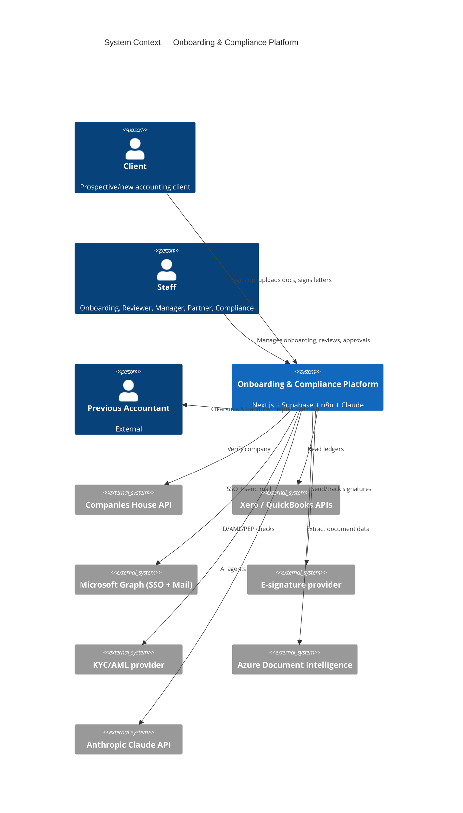
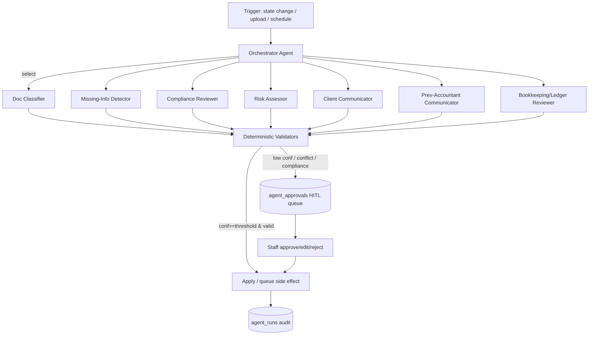
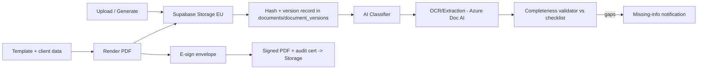
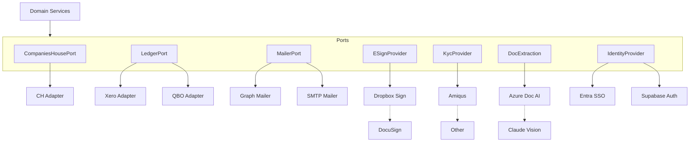
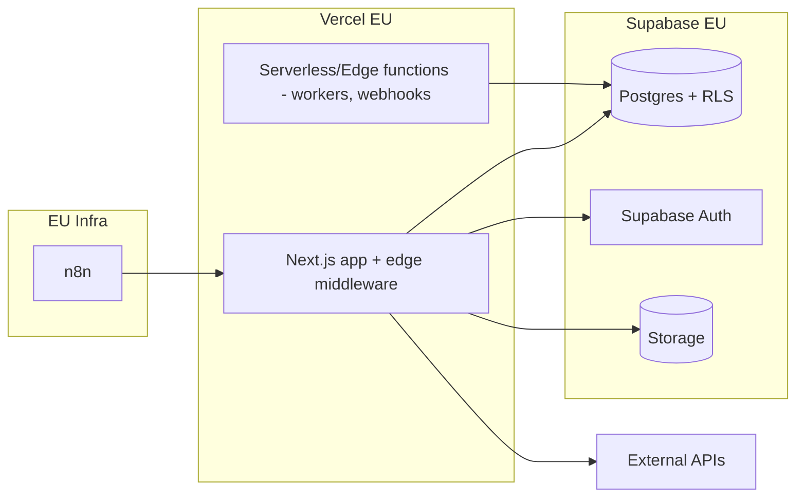

# A2 — System Architecture

**Product:** AI-Powered Client Onboarding & Compliance Platform — GNS Associates
**Document:** A2 of 7 · depends on **A1 (PRD)** · Status: **Draft for approval**

> Traceability: components below cite the PRD requirement IDs they satisfy (e.g. `FR-AML-5`, `NFR-SEC-1`).

---

## 1. Architecture principles

1. **Single writer / system-of-record.** The Next.js app's **service layer** is the only component that writes to Postgres. n8n and AI agents act *through* signed APIs, so validation, RLS and audit are enforced once. (`NFR-AUD-1`, `NFR-SEC-1`)
2. **Ports & adapters (hexagonal).** Every external dependency (KYC, e-sign, OCR, mailer, ledger, Companies House) sits behind a TypeScript **port** with swappable **adapters**. (`NFR-PORT-1`)
3. **Deterministic core, advisory AI.** Business rules and compliance gates are deterministic code. AI is advisory and gated by confidence + HITL. Compliance/risk decisions are **never** auto-applied. (`FR-AI-3`, `FR-AML-5`)
4. **Event-driven side effects.** State changes emit domain events to a transactional **outbox**; n8n and async workers consume them. Guarantees idempotency and no lost work. (`NFR-REL-1`)
5. **Multi-entity by data, not by deployment.** One app, one DB; entity isolation via `entity_id` + RLS. (`BR-ENT-*`)
6. **Secure & private by default.** UK/EU residency, least privilege, encrypted secrets/PII, no PII in logs. (`NFR-PRIV-1`, `NFR-SEC-1`)
7. **Typed end-to-end.** Zod schemas shared client/server/agent; one source of truth for shapes. (`NFR-MAIN-1`)

---

## 2. C4 — Context (Level 1)



## 3. C4 — Containers (Level 2)

```mermaid
C4Container
  title Containers
  Person(user, "Client / Staff")
  Container_Boundary(app, "Platform") {
    Container(web, "Next.js App", "TypeScript, App Router, RSC", "Portals + API routes + server actions")
    Container(svc, "Domain Service Layer", "TS (packages/core)", "Business rules, state machine, ports")
    Container(ai, "AI Agent Service", "TS (packages/ai)", "Orchestrator + 8 agents, HITL, confidence")
    ContainerDb(pg, "PostgreSQL", "Supabase EU", "Tables + RLS + audit + outbox")
    Container(storage, "Object Storage", "Supabase Storage EU", "Documents, generated PDFs")
    Container(n8n, "n8n", "Self-hosted EU", "Schedules, chasers, retries, escalations")
    Container(worker, "Async Workers", "Edge/Serverless functions", "Outbox consumers, long jobs")
  }
  System_Ext(ext, "External APIs", "CH, Xero, Graph, e-sign, KYC, OCR, Claude")
  Rel(user, web, "HTTPS")
  Rel(web, svc, "in-process calls")
  Rel(svc, pg, "SQL (RLS)")
  Rel(svc, storage, "signed URLs")
  Rel(svc, ai, "invoke agents")
  Rel(svc, ext, "via adapters")
  Rel(svc, pg, "write outbox events")
  Rel(n8n, web, "signed webhooks -> API")
  Rel(worker, pg, "consume outbox")
  Rel(ai, claude, "LLM calls")
  Rel(ext, web, "inbound webhooks (e-sign/KYC/ledger)")
```

---

## 4. Frontend architecture (`FR-*` portals, `NFR-USE-1`)

- **Next.js 14 App Router** with **route groups** per portal: `(client)`, `(staff)`, `(admin)`. Server Components by default; client components only for interactivity (uploads, forms, realtime).
- **Design system:** Tailwind + shadcn/ui; entity theming via CSS variables resolved from the selected entity's branding (`BR-ENT-4`).
- **Data fetching:** RSC for reads; **server actions** + **TanStack Query** for mutations/optimistic UI; **Supabase Realtime** for live case/task/document status.
- **Validation:** **Zod** schemas in `packages/config` shared with the backend — no shape drift.
- **Auth context:** middleware resolves session (Entra for staff, Supabase for clients), entity scope, and role → passed to RSC.
- **Accessibility:** WCAG 2.1 AA on client portal; keyboard, focus, ARIA, contrast.

```
apps/web/app
  (client)/  dashboard, checklist, documents, sign, status
  (staff)/   cases, case/[id], reviews, tasks, comms, compliance
  (admin)/   entities, services, templates, users, integrations, settings
  api/       route handlers (REST), webhooks/*, agents/*
  actions/   server actions (mutations through service layer)
  layout.tsx middleware.ts
```

---

## 5. Backend architecture (`NFR-MAIN-1`, `NFR-REL-1`)

**Modular monolith** (deployable as one app; cleanly separable later). Packages:

| Package | Responsibility |
|---|---|
| `packages/core` | Domain services: onboarding state machine, clients, services/pricing, tasks, compliance, documents, reviews. **Ports** for all externals. |
| `packages/db` | Drizzle schema, migrations, RLS, repositories. |
| `packages/ai` | Agent framework, the 8 agents, prompts, tools, confidence, HITL. |
| `packages/config` | Zod schemas, entity/service config, templates registry, constants. |
| `packages/integrations` | Adapters implementing ports (CH, Xero, QBO, Graph, e-sign, KYC, OCR, mailer). |

**Service-layer pattern:** every mutation is a use-case function that (1) authorises, (2) validates (Zod), (3) executes domain logic, (4) writes data **and** an outbox event in one transaction, (5) writes an audit entry. (`NFR-AUD-1`)

**Outbox/event model:** `events` table written in the same tx as the state change; an async worker/n8n dispatches them (webhooks, emails, agent triggers). Guarantees at-least-once + idempotency keys → effectively-once side effects. (`NFR-REL-1`)

**State machine:** `onboarding_cases.status` transitions are guarded functions (`canTransition(from,to,context)`); illegal transitions rejected; each transition writes `case_transitions` + audit. Mirrors PRD §11.

---

## 6. AI agent architecture (`FR-AI-1..4`)



**Framework:** each agent = `{ objective, inputSchema (Zod), outputSchema (Zod, tool-use), prompt, model, validators[], confidencePolicy, hitlPolicy }`. Claude **tool-use / structured outputs** enforce typed JSON. (`FR-AI-2`)

**Model tiering (`NFR-COST-1`):** `claude-haiku-4-5` for classification/extraction; `claude-opus-4-8` for compliance, risk, ledger reasoning and drafting. Token usage logged per run.

**Confidence = model self-report × validator pass.** Validators are deterministic (schema valid, cross-checks vs Companies House/extracted fields, required-field coverage). Conflict or low confidence → HITL.

**HITL queue (`agent_approvals`):** compliance & risk **always** require human sign-off; first client-facing message requires approval; routine chasers auto after the first approval. Approvals are audited with approver, decision, edits.

**Guardrails:** PII minimisation/redaction before prompts; no secrets in prompts; per-run cost ceiling; retries with backoff; deterministic fallback (route to human) on model error. (`NFR-PRIV-1`)

Full per-agent spec (objective/inputs/outputs/prompt/failure/HITL/confidence) is in **Appendix A**.

---

## 7. n8n architecture (`FR-WF-1`, `NFR-REL-1`)

- **Role:** time-based & long-running orchestration only — chasers, scheduled re-checks (Companies House status, sanctions re-screen), retry/dead-letter handling, SLA escalations. **Not** a data writer.
- **Trigger:** consumes domain events (outbox) via signed webhook, or runs on cron.
- **Acts via API:** every effect calls the app's signed REST endpoints (service token, HMAC-signed, idempotency key) so RLS/audit hold. (`NFR-SEC-1`)
- **Hosting:** self-hosted n8n in EU; secrets in n8n credential store; network-restricted to the app API.
- Detailed workflow specs in **A5**.

---

## 8. Document management architecture (`FR-DOC-*`, `FR-COL-*`, `CR-DATA-5`)



- **Generation:** HTML/Handlebars templates per entity+service → PDF (server-side renderer). Generated docs are immutable, versioned, hashed.
- **Storage:** Supabase Storage (EU), private buckets, **signed-URL** access only, integrity hash, virus scan on upload.
- **E-sign:** `ESignProvider` port; envelope lifecycle tracked in `esign_envelopes`/`esign_events`; inbound webhooks update status; signed artifact + certificate stored.
- **Classification/extraction:** `DocExtraction` port; results in `document_classifications`/`document_extractions`; staff override supported. (`FR-COL-6`)

---

## 9. Integration architecture (`CR-INT-*`, `NFR-PORT-1`)



Cross-cutting per adapter: OAuth/token storage **encrypted**, **retry + exponential backoff** (3 attempts), **circuit breaker**, rate-limit handling, request/response logging (PII-scrubbed), **sandbox** in non-prod, and a `healthcheck()`. Mailer fails over Graph → SMTP automatically (`FR-COM-1`).

---

## 10. Security architecture (`NFR-SEC-1`, `NFR-PRIV-1`, `NFR-COMP-1`)

| Layer | Control |
|---|---|
| Identity | Staff: **Entra ID SSO** (OIDC). Clients: **Supabase Auth** (magic-link/password + MFA). |
| Authorisation | App RBAC (role + entity) **and** Postgres **RLS** (defence in depth) by `entity_id` + ownership. |
| Data at rest | Supabase encryption; **column encryption** (pgsodium/KMS) for OAuth tokens, KYC refs, sensitive PII. |
| Data in transit | TLS 1.2+ everywhere; HSTS. |
| Documents | Private buckets, signed URLs, integrity hashing, virus scan. |
| Secrets | Vercel/Supabase env + secret manager; never in repo; rotation supported. |
| Audit | Append-only `audit_logs`; immutable; covers state, docs, AML, AI approvals. |
| AI privacy | No-training DPA; PII minimisation/redaction; per-run logging; human gate on compliance. |
| App security | OWASP ASVS L2: input validation (Zod), output encoding, CSRF on actions, rate limiting, security headers/CSP, dependency scanning. |
| Webhooks | HMAC signature + timestamp + replay protection on all inbound/outbound. |

**Threat model (STRIDE) summary** and data-flow trust boundaries documented in Appendix B (residency boundary = EU; PII never leaves EU; AI calls carry minimised payloads).

---

## 11. Deployment architecture (`NFR-AVAIL-1`, `NFR-DR-1`, `CR-DATA-1`)



- **Environments:** `local` (Supabase CLI) → `dev` → `staging` → `production`, each isolated.
- **Regions:** Vercel EU, Supabase London/Frankfurt, n8n EU. (`CR-DATA-1`)
- **CI/CD:** GitHub Actions — typecheck, lint, unit/integration/E2E, migration check, preview deploys; protected `main`; migrations gated and run pre-deploy.
- **DR:** daily automated backups + PITR; documented **RPO ≤ 24h, RTO ≤ 8h** (to confirm); restore runbook tested.

---

## 12. Reporting & dashboard architecture (`FR-RPT-*`)

- **Operational dashboards** read from **read-optimised views/materialised views** (pipeline, SLA, compliance status, document completeness, agent performance) refreshed on event + schedule.
- **Per-entity security** applied via RLS on the same views.
- **Onboarding completion report** generated as a PDF artifact from case data on `completed`.
- Optional analytics export to a warehouse later (future-scope) — kept out of v1.
- Dashboard UIs: Compliance, Document Centre, Tasks, Communications (wireframes in A6).

---

## 13. Error handling & exception management (`NFR-REL-1`, `NFR-OBS-1`)

- **Typed errors:** `DomainError` (business rule), `IntegrationError` (external), `ValidationError` (Zod), `AuthError`. Mapped to consistent API error envelope (A4 §error model).
- **External calls:** retry w/ backoff + jitter (3×), circuit breaker, timeout; on exhaustion → **dead-letter** event + Sentry alert + case flagged `blocked` with reason. (`Risk: provider outage`)
- **Idempotency:** all event consumers & webhooks use idempotency keys; safe to replay.
- **AI failures:** model error/timeout/low-confidence → route to HITL; never silently proceed on compliance.
- **User-facing:** friendly messages + correlation ID; never leak internals.
- **Observability:** pino structured logs (PII-scrubbed) + OpenTelemetry traces + Sentry; per-`workflow_runs`/`agent_runs` visibility; dashboards for error rates, queue depth, SLA breaches.

---

## 14. Scalability & future considerations (`NFR-SCAL-1`)

- **Stateless web tier** scales horizontally on Vercel; Postgres connection pooling (Supavisor).
- **Read scaling:** materialised views + read replicas when needed; caching for catalogues/config.
- **Async-first:** heavy work (OCR, ledger pulls, AI, generation) runs off the request path via outbox/workers/n8n.
- **Module extraction:** packages can become independent services if load demands (AI service, document service first).
- **Future:** add entities with no code change; add ledger/e-sign/KYC adapters via ports; multi-region read; analytics warehouse; native mobile; additional services (R&D, audit) as plug-in service definitions; webhook/event API for a future PM integration (per PRD "standalone now" boundary).

---

## Appendix A — Per-agent specification (`FR-AI-*`)

Common contract: typed Zod I/O via Claude tool-use; confidence 0–1; validators; HITL routing; full `agent_runs` logging. Model: H = Haiku, O = Opus.

### A.1 Workflow Orchestrator (O)
- **Objective:** given case state + context, decide the next action/agent and enforce gates.
- **Inputs:** case snapshot, completed steps, outstanding gates, entity/service config.
- **Outputs:** `{ nextAction, agentToInvoke?, rationale, confidence }`.
- **Prompt design:** system prompt encodes the PRD §11 state machine + gates; instructed to **never** skip a hard gate; deterministic guard code double-checks every suggestion.
- **Failure handling:** on uncertainty/invalid → no transition, raise to staff.
- **HITL:** none for routing; but cannot bypass compliance gates.
- **Confidence:** lowered if suggested transition fails guard validation (then blocked).

### A.2 Document Classifier (H)
- **Objective:** classify each upload into a document type + entity/service relevance.
- **Inputs:** file metadata, OCR text/vision, checklist taxonomy.
- **Outputs:** `{ docType, subtype, relatedService, confidence, fields? }`.
- **Prompt:** few-shot taxonomy of UK accounting documents; must output a known type or `unknown`.
- **Failure:** `unknown`/low conf → staff review; never auto-files.
- **HITL:** auto-accept ≥ 0.85 precision threshold; else review.
- **Confidence:** model score × extraction sanity (e.g. a "VAT return" must contain a VAT period).

### A.3 Missing-Info Detector (H/O)
- **Objective:** compare collected docs/fields vs required-by-service/entity; list gaps + who must act.
- **Inputs:** checklist, classified docs, extracted fields, client/company data.
- **Outputs:** `{ missingItems[], blockers[], suggestedMessage? , confidence }`.
- **Prompt:** rule-aware; required-set provided deterministically, agent reasons about partials/ambiguity.
- **Failure:** defaults to flagging as missing (safe).
- **HITL:** auto for notifications; blockers surfaced to staff.
- **Confidence:** ↑ when required-set coverage is unambiguous.

### A.4 Compliance Reviewer (O) — **always HITL**
- **Objective:** assess CDD/AML completeness & regulatory checks; recommend pass/EDD/decline.
- **Inputs:** CDD record, KYC/sanctions results, risk score, company data.
- **Outputs:** `{ recommendation, gaps[], reasons[], confidence }` (advisory only).
- **Prompt:** MLR 2017-aware checklist; must cite evidence; must not assert a final decision.
- **Failure:** abstain → route to Compliance Officer.
- **HITL:** **mandatory** Compliance Officer (Partner for high-risk) sign-off. (`FR-AML-5`)
- **Confidence:** never auto-applies regardless of score.

### A.5 Risk Assessor (O)
- **Objective:** produce a structured risk rating (sector, geography, structure, PEP, source of funds).
- **Inputs:** company/officer data, sanctions/PEP, services, geography.
- **Outputs:** `{ rating: Low|Med|High, factors[], rationale, confidence }`.
- **HITL:** High → Partner sign-off mandatory; Med/Low logged for Compliance review.

### A.6 Client Communicator (O)
- **Objective:** draft entity-branded client emails (welcome, requests, chasers).
- **Inputs:** case context, entity branding/template, outstanding items, tone guide.
- **Outputs:** `{ subject, body, channel, confidence }`.
- **HITL:** approve before first send; routine chasers auto after first approval. (`FR-COM-2`)
- **Failure:** never sends on error; queues draft.

### A.7 Previous-Accountant Communicator (O)
- **Objective:** draft professional clearance + records-handover requests and follow-ups.
- **Inputs:** prev-accountant contact, client, services, prior requests.
- **Outputs:** `{ subject, body, attachmentsNeeded[], confidence }`.
- **HITL:** approve first contact; follow-ups auto on schedule with escalation. (`FR-CLR-3`)

### A.8 Bookkeeping/Ledger Reviewer (O)
- **Objective:** analyse Xero/QBO data + docs to surface findings per VAT/PAYE/CIS/accounts/TB.
- **Inputs:** ledger snapshot, TB, VAT/payroll data, prior accounts.
- **Outputs:** `{ findings[]{area, severity, detail, evidenceRef}, confidence }`.
- **HITL:** findings reviewed by Reviewer before action. (`FR-LED-4`)
- **Failure:** on missing data → emits "data gap" finding rather than guessing.

## Appendix B — Trust boundaries (summary)
EU residency boundary encloses Vercel EU, Supabase EU, n8n EU. PII never crosses it. External calls: Companies House (public), ledger/e-sign/KYC over TLS with minimised payloads; Claude receives PII-minimised prompts under a no-training DPA. Inbound webhooks cross the boundary only via HMAC-verified endpoints.

---

## ✅ Approval gate
**This is Deliverable A2.** Proceeding to **A3 — Database Design**.
