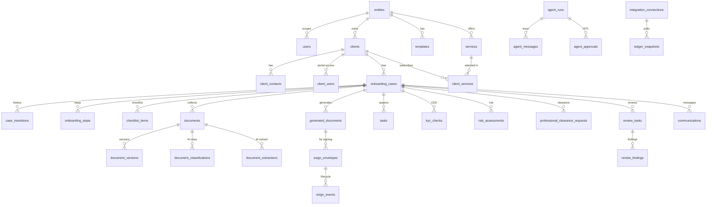
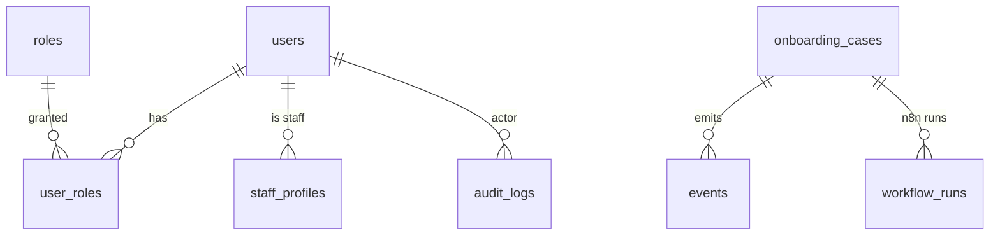

# A3 — Database Design

**Product:** Onboarding & Compliance Platform — GNS Associates
**Document:** A3 of 7 · depends on A1/A2 · Status: **Draft for approval**
**DB:** PostgreSQL 15 (Supabase EU) · ORM/migrations: **Drizzle**

---

## 1. Conventions

- **Keys:** UUID v7 primary keys (`id`), time-sortable. FK columns named `<entity>_id`.
- **Tenancy:** almost every business table carries `entity_id` (FK → `entities`) for RLS scoping. (`BR-ENT-5`)
- **Timestamps:** `created_at`, `updated_at` (UTC, `timestamptz`), `created_by`, `updated_by` (FK → `users`).
- **Soft delete:** `deleted_at timestamptz null`; partial indexes exclude soft-deleted rows; hard-purge via retention jobs. (`CR-DATA-3`)
- **Enums:** Postgres enums for fixed sets (status, role, doc type, severity).
- **Money:** `numeric(12,2)` + `currency char(3)` (default `GBP`). **No floats.**
- **JSON:** `jsonb` for flexible payloads (extracted fields, agent I/O, config); validated by Zod in app.
- **Naming:** snake_case tables/columns; plural table names.
- **Audit:** every mutating write also writes `audit_logs` (app-enforced) — see §6.
- **Encryption:** sensitive columns (`*_token`, KYC refs) stored via pgsodium/KMS; marked 🔒 below. (`NFR-SEC-1`)

---

## 2. ER diagram — core (Mermaid)





---

## 3. Table catalogue

> Column shorthand: `PK`=primary key, `FK`=foreign key, `U`=unique, `NN`=not null, `🔒`=encrypted. Common audit columns (`created_at/updated_at/created_by/updated_by/deleted_at`) implied on all business tables.

### 3.1 Tenancy & identity

**`entities`** — practice entity (GNS/LLP/GXY). (`BR-ENT-1..6`)
| col | type | notes |
|---|---|---|
| id | uuid PK | |
| code | text U NN | e.g. `GNS`, `LLP`, `GXY` |
| legal_name | text NN | |
| trading_name | text | |
| logo_url | text | branding |
| brand | jsonb | colours, fonts, header/footer |
| address | jsonb NN | |
| bank_details | jsonb 🔒 | per-entity bank (`BR-ENT-2`) |
| signatory | jsonb NN | authorised signatory name/role |
| aml_supervisor | jsonb NN | supervisor + registration no. |
| vat_number / company_number | text | |
| settings | jsonb | chaser cadence, SLA, thresholds overrides |
| is_active | bool NN default true | |

**`users`** — staff & client identities.
| id uuid PK · entity_id FK (nullable for cross-entity admins) · email text U NN · auth_provider enum(`entra`,`supabase`) NN · external_id text · display_name · status enum(`active`,`disabled`) · last_login_at |

**`staff_profiles`** — staff-only attributes (job title, capacity, entity assignments[]).
**`roles`** — `Admin, Partner, Manager, OnboardingStaff, Reviewer, ComplianceOfficer, Client, System` (seeded).
**`user_roles`** — (user_id, role_id, entity_id) — role grant per entity. U(user_id, role_id, entity_id).
**`clients`** — client master.
| id PK · entity_id FK NN · type enum(`limited`,`sole_trader`,`partnership`,`llp`,`individual`) · name NN · company_number · companies_house_id FK? · status enum(`prospect`,`onboarding`,`active`,`declined`,`offboarded`) · primary_contact_id FK · risk_rating enum? · source · metadata jsonb |
**`client_contacts`** — people linked to a client (director/PSC/signatory/primary). role flags, email, phone, is_pep flag.
**`client_users`** — maps a `users` row (client auth) to a `clients` row for portal access. U(client_id, user_id).

### 3.2 Services & pricing (`FR-SVC-*`, `FR-PRICE-*`)

**`services`** — catalogue (bookkeeping, VAT, PAYE, CIS, accounts, payroll, SA, CT, confirmation statement…). code U, name, description, default_params jsonb, requires_clearance bool, required_documents jsonb (checklist seed), engagement_clause_ref.
**`service_packages`** — optional bundles of services.
**`client_services`** — selected services per client/case. (client_id, service_id, case_id, params jsonb, status). U(case_id, service_id).
**`pricing_agreements`** — agreed price. (case_id, model enum(`fixed`,`tiered`,`custom`), line_items jsonb, total numeric, currency, accepted_at, accepted_by_contact_id, version).
**`quotes`** — proposal versions before acceptance.

### 3.3 Onboarding engine (`FR-WF-1`, PRD §11)

**`onboarding_cases`** — the case/state machine.
| id PK · entity_id FK NN · client_id FK NN · reference text U (human ref e.g. `GNS-2026-0001`) · status enum (see §4) NN · substatus enum(`on_hold`,`blocked`,`rejected`,`cancelled`,null) · assigned_to FK(users) · priority · risk_rating enum? · sla_due_at · opened_at · completed_at · blocked_reason · metadata jsonb |
**`case_transitions`** — append-only history. (case_id, from_status, to_status, actor_id, reason, occurred_at). Index(case_id, occurred_at).
**`onboarding_steps`** — per-case step instances with status/owner/timestamps (derived from a template per entity+services).
**`checklist_items`** — required items (documents/actions) per case; (case_id, key, label, category, required bool, status enum(`pending`,`received`,`verified`,`na`), document_id FK?, responsible enum(`client`,`staff`)). (`FR-COL-2`, `FR-COL-5`)

### 3.4 Documents (`FR-DOC-*`, `FR-COL-*`)

**`documents`** — uploaded/collected docs. (id, entity_id, case_id, client_id, source enum(`client_upload`,`staff_upload`,`generated`,`previous_accountant`), storage_path, filename, mime, size_bytes, sha256, status enum(`uploaded`,`classified`,`verified`,`rejected`), checklist_item_id FK?).
**`document_versions`** — version history (document_id, version, storage_path, sha256, created_by).
**`document_classifications`** — AI output (document_id, doc_type, subtype, related_service_id, confidence numeric, model, agent_run_id, accepted bool, overridden_by). (`FR-COL-3`,`FR-COL-6`)
**`document_extractions`** — OCR/extraction (document_id, fields jsonb, confidence, provider, agent_run_id). (`FR-COL-4`)
**`generated_documents`** — auth/engagement letters. (id, entity_id, case_id, type enum(`authorisation`,`engagement`,`other`), template_id FK, payload jsonb, storage_path, sha256, status enum(`draft`,`issued`,`signed`,`void`), version). (`FR-DOC-1..3`)
**`templates`** — entity+type templates. (entity_id, type, service_id?, name, engine enum(`handlebars`), body, version, is_active). (`BR-ENT-2`,`BR-ENT-6`)
**`esign_envelopes`** — (id, generated_document_id FK, provider, provider_envelope_id 🔒, status enum(`created`,`sent`,`delivered`,`completed`,`declined`,`voided`,`expired`), signers jsonb, sent_at, completed_at, chase_count, next_chase_at). (`FR-DOC-4..6`)
**`esign_events`** — provider webhook events (envelope_id, event_type, payload jsonb, occurred_at). idempotent on provider event id.

### 3.5 Compliance / AML (`FR-AML-*`, `FR-CLR-*`)

**`kyc_checks`** — (id, case_id, client_contact_id, provider, provider_ref 🔒, type enum(`idv`,`aml`,`sanctions`,`pep`), status enum(`pending`,`passed`,`referred`,`failed`), result jsonb, requested_at, completed_at). (`FR-AML-1,2`)
**`sanctions_screenings`** — (id, case_id, subject, matches jsonb, status, screened_at, rescreen_due_at). (`FR-AML-2,6`)
**`risk_assessments`** — (id, case_id, rating enum(`low`,`medium`,`high`), factors jsonb, rationale, agent_run_id?, assessed_by, signed_off_by, signed_off_at). (`FR-AML-3`)
**`cdd_records`** — (id, case_id, status enum(`incomplete`,`complete`,`edd_required`), evidence jsonb, outcome enum(`pass`,`decline`,`edd`), compliance_officer_id, signed_off_at). **Gate for completion** (`FR-AML-4,5`).
**`professional_clearance_requests`** — (id, case_id, previous_accountant jsonb, status enum(`pending`,`sent`,`responded`,`no_objection`,`objection`,`no_response`), sent_at, responded_at, next_followup_at, followup_count). (`FR-CLR-1,3`)
**`clearance_followups`** — follow-up log (request_id, attempt, sent_at, channel).

### 3.6 Reviews & tasks (`FR-TASK-*`, `FR-LED-3,4`)

**`task_templates`** — (entity_id?, key, title, default_role, sla_hours, trigger_state, conditions jsonb).
**`tasks`** — (id, entity_id, case_id?, title, description, status enum(`open`,`in_progress`,`blocked`,`done`,`cancelled`), assigned_to, role, due_at, sla_breached bool, parent_task_id?, source enum(`auto`,`manual`)). (`FR-TASK-1..3`)
**`review_tasks`** — specialised review. (id, case_id, area enum(`bookkeeping`,`vat`,`paye`,`cis`,`accounts`,`trial_balance`), status, reviewer_id, ledger_snapshot_id FK?, summary). (`FR-LED-3`)
**`review_findings`** — (review_task_id, area, severity enum(`info`,`low`,`medium`,`high`), detail, evidence_ref, agent_run_id?, resolved bool). (`FR-LED-4`)

### 3.7 Integrations (`CR-INT-*`)

**`integration_connections`** — (id, entity_id, client_id?, provider enum(`xero`,`qbo`,`graph`,`companies_house`,`esign`,`kyc`,`ocr`), access_token 🔒, refresh_token 🔒, scopes, expires_at, status enum(`connected`,`expired`,`revoked`), metadata jsonb). (`FR-LED-1`)
**`companies_house_records`** — cached CH data (client_id, company_number, profile jsonb, officers jsonb, psc jsonb, fetched_at). (`FR-CH-2`)
**`ledger_snapshots`** — (id, case_id, connection_id, kind enum(`trial_balance`,`ledgers`,`vat`,`payroll`,`coa`), payload jsonb, period, captured_at). (`FR-LED-2`)

### 3.8 AI (`FR-AI-*`)

**`agent_runs`** — (id, case_id?, agent enum, model, input jsonb, output jsonb, confidence numeric, validator_result jsonb, status enum(`succeeded`,`failed`,`needs_review`), tokens_in, tokens_out, cost numeric, started_at, finished_at). (`FR-AI-4`,`NFR-COST-1`)
**`agent_messages`** — message-level trace for a run (run_id, role, content jsonb, seq).
**`agent_approvals`** — HITL queue. (id, agent_run_id, type enum(`compliance`,`risk`,`client_comm`,`prev_acc_comm`,`classification`), status enum(`pending`,`approved`,`rejected`,`edited`), assigned_role, decided_by, decision_notes, edited_output jsonb, decided_at). (`FR-AI-2,3`)

### 3.9 Comms (`FR-COM-*`)

**`communications`** — (id, entity_id, case_id, direction enum(`outbound`,`inbound`), channel enum(`email`,`in_app`), provider enum(`graph`,`smtp`,null), to/from jsonb, subject, body, status enum(`queued`,`sent`,`delivered`,`failed`,`received`), provider_ref, agent_run_id?, thread_id, sent_at). (`FR-COM-1..3`)
**`email_threads`** — groups communications.
**`notifications`** — in-app (user_id, type, payload jsonb, read_at).

### 3.10 Platform

**`audit_logs`** — **append-only**. (id, entity_id, actor_id, actor_type enum(`user`,`system`,`agent`), action, resource_type, resource_id, before jsonb, after jsonb, ip, occurred_at). No update/delete grants. (`NFR-AUD-1`,`CR-DATA-6`)
**`events`** — transactional **outbox**. (id, entity_id, type, payload jsonb, status enum(`pending`,`dispatched`,`failed`,`dead`), attempts, available_at, dispatched_at, idempotency_key U). (`NFR-REL-1`)
**`workflow_runs`** — n8n run tracking (id, workflow_key, case_id?, status, input jsonb, output jsonb, error, started_at, finished_at).
**`retention_jobs`** — (id, resource_type, policy, scheduled_for, executed_at, purged_count). (`CR-DATA-2,3`)
**`attachments`** — generic attachment linkage (polymorphic to tasks/communications).

---

## 4. Status enum (onboarding_cases.status)

`lead, service_selection, pricing_agreed, company_verified, kyc_cdd, risk_assessed, auth_letter_signed, engagement_signed, clearance_requested, handover, ledger_connected, reviews_in_progress, docs_complete, compliance_passed, tasks_created, completed`
plus `substatus`: `on_hold | blocked | rejected | cancelled | null`. Transitions guarded in `packages/core` (A2 §5).

---

## 5. Indexes (representative)

- `clients (entity_id, status)`, `clients (company_number)`.
- `onboarding_cases (entity_id, status)`, `(assigned_to, status)`, `(sla_due_at) where status not in terminal`.
- `case_transitions (case_id, occurred_at desc)`.
- `documents (case_id, status)`, `documents (sha256)` (dedupe), `(checklist_item_id)`.
- `esign_envelopes (status, next_chase_at) where status in ('sent','delivered')` (chaser scan).
- `professional_clearance_requests (status, next_followup_at)`.
- `tasks (assigned_to, status, due_at)`, `(case_id)`, `(sla_breached) where status not in ('done','cancelled')`.
- `events (status, available_at) where status='pending'` (dispatcher).
- `agent_approvals (status, assigned_role) where status='pending'`.
- `audit_logs (resource_type, resource_id, occurred_at)`, `(entity_id, occurred_at)`.
- Partial indexes everywhere exclude `deleted_at is not null`.
- GIN indexes on heavily-queried `jsonb` (e.g. `document_extractions.fields`) where needed.

---

## 6. Audit strategy (`NFR-AUD-1`)

- **App-enforced:** the service layer writes an `audit_logs` row in the same transaction as every mutating use-case (action, before/after, actor).
- **DB-enforced backstop:** triggers on the most sensitive tables (`cdd_records`, `risk_assessments`, `generated_documents`, `agent_approvals`, `onboarding_cases`) also emit audit rows, so nothing slips past.
- `audit_logs` has **no UPDATE/DELETE** privileges for app roles (append-only); retained per `CR-DATA-6`.
- Covers: state transitions, document lifecycle, AML/CDD decisions, AI approvals, config changes, auth events.

---

## 7. Row-Level Security (RLS) (`NFR-SEC-1`, `BR-ENT-5`)

RLS enabled on all business tables. Session carries `auth.uid()` and JWT claims (`role`, `entity_ids[]`, `client_id` for clients). Policy patterns:

- **Staff (entity-scoped):** `USING (entity_id = ANY(current_entity_ids()))`. Admins: bypass via `is_admin()`.
- **Clients:** `USING (client_id = current_client_id())` on `clients`, `onboarding_cases`, `documents`, `communications`, `checklist_items`, `generated_documents` (own only). (`FR-COL-1` client sees own).
- **Write policies:** narrower than read — e.g. clients may INSERT documents only for their own open case; cannot write compliance tables.
- **Compliance Officer:** read across assigned entities for compliance tables; sign-off writes restricted to that role.
- **System/agent role:** service-role key used only by server; still routed through service layer (no direct table writes from n8n/agents).

Helper SQL functions: `current_entity_ids()`, `current_client_id()`, `is_admin()`, `has_role(text)`.

---

## 8. Migration strategy

- **Tooling:** drizzle-kit; migrations are SQL files checked into `packages/db/migrations`, forward-only, reviewed in PRs.
- **Process:** `local` (Supabase CLI) → generate migration → test → apply in `dev`/`staging`/`prod` via CI **before** app deploy; deploys are blocked if a pending migration is incompatible.
- **Zero-downtime:** expand-and-contract for breaking changes (add column/backfill/switch reads/drop later).
- **Seed data:** roles, default services, default task/document templates, the three entities (config-driven), enum values — idempotent seed scripts per environment.
- **RLS & policies** are part of migrations (versioned alongside tables).
- **Rollback:** paired down-migration or compensating forward migration; backups + PITR as ultimate safety.

---

## 9. Retention policies (`CR-DATA-2,3`, `NFR-PRIV-1`)

| Data class | Default retention | Mechanism |
|---|---|---|
| Client/case/financial records | current year + **6 years** after offboarding | soft-delete → scheduled hard purge (`retention_jobs`) |
| Documents (KYC, letters, ledgers) | as above; legal-hold overrides | versioned store; purge logs |
| Audit logs | ≥ regulatory minimum (≥6y) | append-only; not purged before minimum |
| AI agent runs | configurable (default 2y) | purge with PII redaction |
| Communications | as client records | purge with case |
| DSAR/erasure | on request, subject to legal hold | targeted redaction/erasure workflow |

- **Erasure** respects legal-hold and retention obligations; produces an audited erasure record.
- **DSAR export** assembles all subject data (client_id) into a portable bundle. (`CR-DATA-4`)

---

## 10. Representative Drizzle schema (excerpt)

```ts
// packages/db/schema/onboarding.ts
import { pgTable, uuid, text, timestamp, jsonb, boolean, pgEnum, numeric, index } from "drizzle-orm/pg-core";
import { entities } from "./tenancy";
import { clients } from "./clients";

export const caseStatus = pgEnum("case_status", [
  "lead","service_selection","pricing_agreed","company_verified","kyc_cdd",
  "risk_assessed","auth_letter_signed","engagement_signed","clearance_requested",
  "handover","ledger_connected","reviews_in_progress","docs_complete",
  "compliance_passed","tasks_created","completed",
]);
export const caseSubstatus = pgEnum("case_substatus", ["on_hold","blocked","rejected","cancelled"]);

export const onboardingCases = pgTable("onboarding_cases", {
  id: uuid("id").primaryKey().defaultRandom(),
  entityId: uuid("entity_id").notNull().references(() => entities.id),
  clientId: uuid("client_id").notNull().references(() => clients.id),
  reference: text("reference").notNull().unique(),
  status: caseStatus("status").notNull().default("lead"),
  substatus: caseSubstatus("substatus"),
  assignedTo: uuid("assigned_to"),
  riskRating: text("risk_rating"),
  slaDueAt: timestamp("sla_due_at", { withTimezone: true }),
  blockedReason: text("blocked_reason"),
  metadata: jsonb("metadata").$type<Record<string, unknown>>().default({}),
  openedAt: timestamp("opened_at", { withTimezone: true }).defaultNow(),
  completedAt: timestamp("completed_at", { withTimezone: true }),
  createdAt: timestamp("created_at", { withTimezone: true }).defaultNow().notNull(),
  updatedAt: timestamp("updated_at", { withTimezone: true }).defaultNow().notNull(),
  deletedAt: timestamp("deleted_at", { withTimezone: true }),
}, (t) => ({
  byEntityStatus: index("idx_cases_entity_status").on(t.entityId, t.status),
  byAssignee: index("idx_cases_assignee").on(t.assignedTo, t.status),
}));
```

```sql
-- RLS example
ALTER TABLE onboarding_cases ENABLE ROW LEVEL SECURITY;
CREATE POLICY cases_staff_read ON onboarding_cases FOR SELECT
  USING (is_admin() OR entity_id = ANY(current_entity_ids()));
CREATE POLICY cases_client_read ON onboarding_cases FOR SELECT
  USING (client_id = current_client_id());
```

---

## ✅ Approval gate
**This is Deliverable A3.** Proceeding to **A4 — API Design**.
