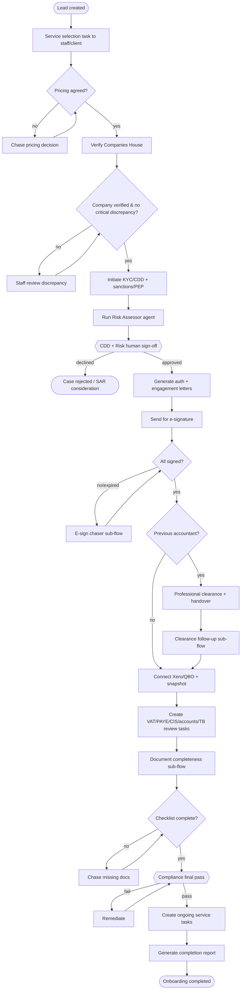
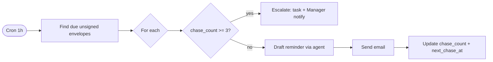

# A5 — n8n Workflow Design

**Product:** Onboarding & Compliance Platform — GNS Associates
**Document:** A5 of 7 · depends on A1–A4 · Status: **Draft for approval**

> Pattern (A2 §7): the app owns the authoritative state machine; n8n handles **time-based & long-running orchestration** and acts **only through signed app APIs** (HMAC + service token + idempotency key). Every workflow logs to `workflow_runs`; failures dead-letter to `events` + Sentry.

**Each workflow below specifies: Trigger · Steps · Decision points · Error paths · Retry logic · Escalation logic.**

---

## 0. Conventions for all workflows

- **Triggering:** app outbox → signed webhook to an n8n Webhook node, **or** n8n Cron node.
- **Idempotency:** every app call sends `Idempotency-Key`; safe to re-run.
- **Retry (default):** 3 attempts, exponential backoff (30s, 2m, 10m) + jitter on `INTEGRATION_ERROR`/5xx; no retry on `4xx` (except `429` → honour `Retry-After`).
- **Error path (default):** on exhaustion → write `events(status='dead')`, raise Sentry, call `POST /cases/{id}/hold` with reason, notify assigned staff.
- **Escalation (default):** SLA breach or N failed attempts → notify Manager; second breach → Partner.

---

## 1. Master Onboarding Orchestration (BPMN-style)

**Trigger:** `lead.created` event (from `POST /leads`).

- **Decision points:** pricing agreed; company verified; CDD+risk sign-off; all signed; previous accountant exists; checklist complete; compliance final pass.
- **Error paths:** any external failure → default error path (§0). KYC `referred`/`failed` → route to Compliance (EDD) not auto-reject.
- **Retry:** per §0 on each integration call.
- **Escalation:** stalls at any gate beyond SLA → Manager then Partner; AML decline → Compliance Officer + Partner.

> n8n does **not** flip case state directly; it calls `POST /cases/{id}/transition`, and the app guard enforces legality (A4 §5.2). This keeps the diagram and the code in lock-step.

---

## 2. E-signature chaser (sub-workflow)

- **Trigger:** Cron every 1h scanning, seeded by `esign.sent`; queries envelopes via `GET` where `status in (sent,delivered)` and `next_chase_at <= now`.
- **Steps:** for each → draft reminder (Client Communicator agent, auto after first approval) → `POST /cases/{id}/messages` → increment `chase_count` → set `next_chase_at` per cadence (T+3, T+7, T+14 days).
- **Decision points:** `chase_count >= max (3)?`; envelope `expired`?
- **Error path:** mail send fails → Graph→SMTP fallback handled in app; if both fail → dead-letter + notify staff.
- **Retry:** mail send 3× backoff.
- **Escalation:** after max chases unsigned → create task for assigned staff + notify Manager; mark step `blocked`.

---

## 3. Professional clearance follow-up (sub-workflow)

- **Trigger:** `clearance.requested`; Cron daily scan of `professional_clearance_requests` where `status in (sent)` and `next_followup_at <= now`.
- **Steps:** draft follow-up (Prev-Accountant Communicator) → send → log `clearance_followups` → set next follow-up (T+7, T+14, T+21).
- **Decision points:** response received? `followup_count >= 3`?
- **Error path:** default; if previous accountant email bounces → flag staff to obtain correct contact.
- **Escalation:** no response after 3 follow-ups → set `status='no_response'`, emit `clearance.no_response`, create staff task, notify Manager; case may proceed if practice rules allow (configurable per entity).

---

## 4. Document completeness & chasing (sub-workflow)

- **Trigger:** `document.uploaded`/`document.classified` and Cron daily.
- **Steps:** call `GET /cases/{id}/checklist` → run Missing-Info Detector → if gaps, draft client request (Client Communicator) → send → set reminder.
- **Decision points:** any required item missing? client vs staff responsible?
- **Error path:** classification/extraction failure → route document to staff review (HITL), don't block silently.
- **Retry:** OCR/classify retried in app; agent errors → HITL.
- **Escalation:** repeated non-response from client → notify Onboarding Staff → Manager.

---

## 5. Ledger connection & review (sub-workflow)

- **Trigger:** `ledger.connected`.
- **Steps:** `POST /cases/{id}/ledger/snapshot` (TB, ledgers, VAT, payroll) → `POST /cases/{id}/reviews` (creates review tasks for applicable services) → `POST /reviews/{id}/run-ai` (Ledger Reviewer) → findings to reviewers.
- **Decision points:** which services active (drives which reviews); data available per area?
- **Error path:** token expired → trigger re-auth (notify staff/client); missing data → emit "data gap" finding rather than guess.
- **Retry:** API pulls 3× backoff; respect provider rate limits.
- **Escalation:** persistent connection failure → task to staff to reconnect.

---

## 6. Scheduled re-checks (compliance freshness)

- **Trigger:** Cron daily/weekly.
- **Steps:** (a) **Companies House re-check** (`FR-CH-4`) — re-pull status; flag dissolution/strike-off → notify Compliance + Partner. (b) **Sanctions/PEP re-screen** (`FR-AML-6`) for in-progress and active clients past `rescreen_due_at`; new match → create Compliance review + block sensitive steps.
- **Decision points:** status changed? new sanctions match?
- **Error path / retry:** default.
- **Escalation:** any adverse change → Compliance Officer immediately; Partner for high-risk.

---

## 7. SLA & stalled-case monitor

- **Trigger:** Cron hourly.
- **Steps:** query cases/tasks past `sla_due_at` and not terminal → notify owners; compute stalled cases (no transition in N days) → surface on dashboard + notify Manager.
- **Decision points:** breach severity (warn vs breach); first vs repeat.
- **Escalation:** first breach → Manager; repeat/critical → Partner. Detection latency target ≤ 1 day (KPI §5).

---

## 8. Outbox dispatcher & dead-letter handler

- **Trigger:** app worker primarily; n8n Cron as backstop every 5m.
- **Steps:** read `events(status='pending', available_at<=now)` → deliver to target workflow/webhook → mark `dispatched`; on failure increment `attempts`, reschedule with backoff; after max → `status='dead'` + Sentry + ops alert.
- **Decision points:** attempts exceeded?
- **Retry/Escalation:** as above; dead events visible on an ops dashboard for manual replay (`POST` replay endpoint).

---

## 9. Workflow ↔ event ↔ state map (traceability)

| Event (A4 §6.2) | Workflow | Resulting app transition |
|---|---|---|
| `lead.created` | Master orchestration | → `service_selection` |
| `pricing.agreed` | Master | → `company_verified` (after CH) |
| `kyc.completed` + sign-offs | Master / compliance | → `risk_assessed`/`auth_letter_signed` |
| `esign.completed` | E-sign chaser closes | → `engagement_signed` |
| `clearance.no_response` | Clearance follow-up | → `handover` (per entity rule) |
| `documents.incomplete` | Doc completeness | hold/chase (no advance) |
| `ledger.connected` | Ledger review | → `reviews_in_progress` |
| `cdd.signed_off` | Compliance | enables `compliance_passed` |
| `case.completed` | Completion | report generated |
| `task.overdue` | SLA monitor | escalation only |

---

## 10. Operational notes

- n8n credentials in its encrypted store; network-restricted egress to app API + provider webhooks only.
- All workflows are **exported as JSON** into `/n8n` in the repo and version-controlled (built in M12).
- Workflows are **idempotent and resumable**; replaying an event must not double-send (idempotency keys).
- Each workflow has a test fixture (mock event → assert API calls) for CI.

---

## ✅ Approval gate
**This is Deliverable A5.** Proceeding to **A6 — UI Wireframes**.
