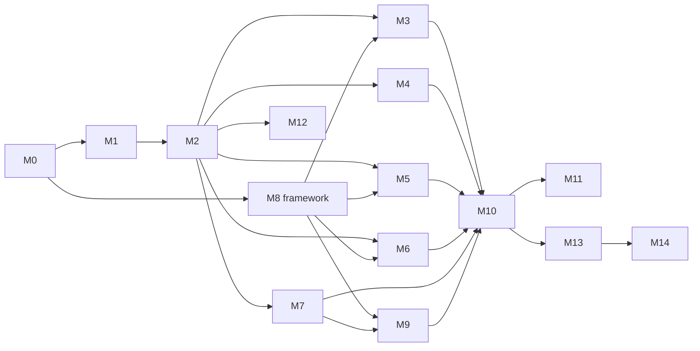

# A7 — Development Task Backlog

**Product:** Onboarding & Compliance Platform — GNS Associates
**Document:** A7 of 7 · depends on A1–A6 · Status: **Draft for approval**

> Backlog is organised as **Epics = Modules (M0–M14)** from the approved plan. Each epic lists stories with **acceptance criteria**, an estimate (story points, Fibonacci), and dependencies. Stories trace to PRD requirements. This is the build order for Phase B (each module is an approval-gated delivery).

**Definition of Done (every story):** code + unit/integration tests (≥80% on core logic) · types pass · lint pass · migrations (if any) reviewed · API docs updated · RLS/audit covered where relevant · demo script + deploy notes · meets acceptance criteria.

**Estimation legend:** 1–2 trivial · 3 small · 5 medium · 8 large · 13 split-candidate.

---

## M0 — Foundation & infra · *prereq for all*
| Story | Acceptance criteria | Pts |
|---|---|---|
| Monorepo scaffold (pnpm, Next.js 14 TS, packages: db/core/ai/config/integrations) | App boots; CI runs typecheck/lint/test; repo layout per A2 §5 | 5 |
| Supabase EU project + local stack | `supabase start` works; EU region; envs `local/dev/staging/prod` | 3 |
| Drizzle setup + migration pipeline | `drizzle-kit` generates/applies; CI gates migrations (A3 §8) | 5 |
| Base layout, theming, shadcn/ui, entity theme tokens | Renders 3 portal shells; entity theme switch works (`BR-ENT-4`) | 5 |
| Observability baseline (pino, Sentry, request-id, OTel) | Errors in Sentry; correlation id in logs/responses (`NFR-OBS-1`) | 5 |
| CI/CD (GitHub Actions + Vercel preview) | PR → preview deploy; protected main | 3 |
| Secrets & config management | No secrets in repo; typed env validation (Zod) | 2 |

**Dependencies:** none. **Exit:** empty app deploys to EU with CI/CD, DB migrations, logging.

---

## M1 — Identity, RBAC & multi-entity · *FR-ADM-2, BR-ENT-*, NFR-SEC-1*
| Story | Acceptance | Pts |
|---|---|---|
| Entra ID SSO for staff | Staff sign in via Entra; JWT carries role+entity_ids | 8 |
| Supabase Auth for clients (MFA) | Client magic-link/password + MFA; JWT carries client_id | 5 |
| Roles & permission model | 8 roles seeded; `authorize()` helper; matrix (PRD §7) enforced | 5 |
| RLS foundation + helper SQL fns | `current_entity_ids/current_client_id/is_admin/has_role`; policies on core tables (A3 §7) | 8 |
| Entities CRUD + config (branding/bank/signatory/AML/settings) | Admin manages GNS/LLP/GXY; encrypted bank details | 8 |
| Audit log infra (app + DB triggers) | Mutations write `audit_logs`; append-only enforced (`NFR-AUD-1`) | 5 |

**Depends:** M0. **Exit:** secure multi-entity auth + audit baseline.

---

## M2 — Client master, services/pricing & onboarding state machine · *FR-LEAD/SVC/PRICE/WF*
| Story | Acceptance | Pts |
|---|---|---|
| Clients + contacts model & CRUD | Create/edit client + contacts; entity-scoped | 5 |
| Lead intake → auto client + case | `POST /leads` creates client+case; reference generated (`FR-LEAD-2`) | 5 |
| Services catalogue + selection | Select services with params (`FR-SVC-*`) | 5 |
| Pricing/quote + acceptance | Quote generated; acceptance recorded (`FR-PRICE-*`) | 5 |
| **Onboarding state machine** + guards | Guarded transitions; illegal → 409; `case_transitions` + audit (`FR-WF-1`) | 8 |
| Case pipeline list + detail UI (A6 §3) | Pipeline filters; case workspace; gate-aware Advance button | 8 |
| Checklist + task template engine | Checklist/tasks generated from entity+services (`FR-COL-2`,`FR-TASK-1`) | 5 |
| Outbox/events + dispatcher | Transactional outbox; worker dispatches; idempotent (`NFR-REL-1`) | 8 |

**Depends:** M1. **Exit:** a case can be created and walked through states (no externals yet).

---

## M3 — Document management + OCR/classification · *FR-COL-*, FR-DOC-3*
| Story | Acceptance | Pts |
|---|---|---|
| Storage + upload (signed URLs, hash, AV scan) | Client/staff upload; versioned; integrity hash (`CR-DATA-5`) | 8 |
| `DocExtraction` port + Azure Doc AI adapter | OCR/extract fields; results stored; provider swappable (`NFR-PORT-1`) | 8 |
| Document Classifier agent (A2 A.2) | Classify uploads; confidence; auto ≥0.85 else review (`FR-COL-3`) | 8 |
| Missing-Info Detector agent (A2 A.3) | Gaps vs checklist; blockers flagged (`FR-COL-5`) | 5 |
| Document Center UI + staff override | Reclassify/edit fields; bulk actions (`FR-COL-6`, A6 §6) | 5 |

**Depends:** M2, M8-core (agent framework — sequence M8 framework partly before/with M3). **Exit:** uploads classified, extracted, validated.

---

## M4 — Document generation + e-signature · *FR-DOC-1,2,4,5,6, BR-ENT-2,6*
| Story | Acceptance | Pts |
|---|---|---|
| Template engine (Handlebars) + admin editor + preview | Entity+service templates; live preview (A6 §4.2) | 8 |
| Auth & engagement letter generation → PDF | Correct entity branding/signatory/bank; versioned, immutable (`FR-DOC-1..3`) | 8 |
| `ESignProvider` port + default adapter (Dropbox Sign) | Send envelope; track status; DocuSign pluggable | 8 |
| E-sign webhooks + state advance | Signed PDF+cert stored; case advances (`FR-DOC-6`) | 5 |
| E-sign chaser (n8n + Client Communicator) | Auto chase cadence; escalate after max (A5 §2) | 5 |

**Depends:** M2, M3 (agents), M1 (entities). **Exit:** generate → sign → advance, with chasing.

---

## M5 — Companies House + KYC/AML · *FR-CH-*, FR-AML-*
| Story | Acceptance | Pts |
|---|---|---|
| `CompaniesHousePort` + adapter; verify + enrich | Lookup, enrich, discrepancy flags (`FR-CH-1..3`) | 5 |
| CH scheduled re-check (n8n) | Strike-off/dissolution alerts (`FR-CH-4`) | 3 |
| `KycProvider` port + Amiqus adapter | IDV/AML initiate; webhook results (`FR-AML-1`) | 8 |
| Sanctions/PEP screening + re-screen | Matches stored; re-screen schedule (`FR-AML-2,6`) | 5 |
| Risk Assessor agent + sign-off | Risk rating; Partner sign-off for High (`FR-AML-3`) | 8 |
| CDD record + **completion gate** | CDD sign-off required to complete; 409 if incomplete (`FR-AML-4,5`) | 5 |
| Compliance Reviewer agent (always HITL) | Advisory recommendation; mandatory sign-off (A2 A.4) | 5 |

**Depends:** M2, M8-framework. **Exit:** full CDD/risk pipeline with hard gates.

---

## M6 — Professional clearance & prev-accountant comms · *FR-CLR-*, FR-COM-*
| Story | Acceptance | Pts |
|---|---|---|
| `Mailer` port + Graph adapter + SMTP fallback | Send via Graph; auto-fallback SMTP; logged (`FR-COM-1`) | 8 |
| Clearance + handover request generation | Drafted, sent, logged (`FR-CLR-1,2`) | 5 |
| Prev-Accountant Communicator agent | Drafts + follow-ups; first contact HITL (A2 A.7) | 5 |
| Clearance follow-up workflow (n8n) | Auto follow-ups + escalation; no-response handling (A5 §3) | 5 |
| Communication Center UI | Threads, timeline, draft approval, delivery status (A6 §8) | 5 |

**Depends:** M2, M4-agents. **Exit:** clearance lifecycle automated and auditable.

---

## M7 — Accounting integrations (Xero-first, then QBO) · *FR-LED-1,2, CR-INT-2,3*
| Story | Acceptance | Pts |
|---|---|---|
| `LedgerPort` + token mgmt (encrypted) | OAuth connect; refresh; revoke; health (`FR-LED-1`) | 8 |
| Xero adapter (deep read) | Pull TB, COA, ledgers, VAT, payroll → snapshots (`FR-LED-2`) | 13 |
| QuickBooks adapter | Same contract; QBO data → snapshots | 8 |
| Ledger snapshot model + viewer | Snapshots stored, viewable per area | 5 |

**Depends:** M2. **Exit:** live ledger data available for reviews.

---

## M8 — AI agent platform · *FR-AI-* (framework lands early; agents fill in per module)*
| Story | Acceptance | Pts |
|---|---|---|
| Agent framework (Zod tool-use, model tiering, run logging) | `agent_runs` logged; Haiku/Opus tiering; cost capture (`FR-AI-4`) | 8 |
| Confidence + deterministic validators | Confidence policy; validator conflict → HITL (`FR-AI-2`) | 5 |
| HITL approval queue (`agent_approvals`) + UI | Approve/edit/reject with notes; audited (`FR-AI-3`, A6 §5) | 8 |
| Orchestrator agent | Suggests next action; guard double-check (A2 A.1) | 5 |
| Agent evaluation harness | Labelled fixture set; precision/recall thresholds asserted in CI | 5 |
| PII minimisation/redaction in prompts | No PII/secrets leak; tested (`NFR-PRIV-1`) | 5 |

**Depends:** M0/M1. **Note:** framework (first 3 stories) is sequenced **before/with M3** since M3/M5/M6 agents depend on it. **Exit:** safe, audited, evaluable agent platform.

---

## M9 — Review task engine · *FR-LED-3,4*
| Story | Acceptance | Pts |
|---|---|---|
| Review task creation per active service | VAT/PAYE/CIS/accounts/TB tasks auto-created (`FR-LED-3`) | 5 |
| Bookkeeping/Ledger Reviewer agent | Findings w/ severity+evidence; staff-reviewed (A2 A.8) | 8 |
| Review workspace UI (A6 §3.3) | Findings, evidence, create-task, mark-reviewed | 5 |
| Findings → tasks linkage | Findings spawn actionable tasks | 3 |

**Depends:** M7, M8. **Exit:** AI-assisted reviews producing actionable findings.

---

## M10 — Portals & dashboards · *FR-RPT-3, A6*
| Story | Acceptance | Pts |
|---|---|---|
| Client portal (dashboard/checklist/sign/messages) | End-to-end client journey (A6 §2); WCAG AA | 13 |
| Staff portal polish (pipeline/case/tasks/comms) | Complete staff workspace | 8 |
| Admin portal (entities/services/templates/users/integrations) | Full config UI (A6 §4) | 8 |
| Compliance dashboard (HITL + metrics) | Sign-off queue, re-screen due, CH alerts (A6 §5) | 8 |
| Document Center, Task board, Comms center | A6 §6–8 complete | 8 |

**Depends:** M2–M9. **Exit:** all portals & dashboards usable.

---

## M11 — Reporting & completion report · *FR-RPT-1,2*
| Story | Acceptance | Pts |
|---|---|---|
| Read-optimised views/materialised views | Pipeline/SLA/compliance/docs/agents views (A2 §12) | 5 |
| Operational reports UI | Filterable per entity; export | 5 |
| Onboarding completion report (PDF) | Generated on `completed` with full summary (`FR-RPT-1`) | 5 |

**Depends:** M10. **Exit:** reporting + completion artifact.

---

## M12 — n8n automation wiring · *A5*
| Story | Acceptance | Pts |
|---|---|---|
| Signed webhook bridge (app↔n8n) | HMAC + service token + idempotency (A2 §7) | 5 |
| Master orchestration + sub-workflows | Chasers, clearance, doc-completeness, ledger, re-checks, SLA (A5 §1–7) | 13 |
| Dead-letter + replay handling | Failed events visible + replayable (A5 §8) | 5 |
| Workflows exported to `/n8n` + tests | JSON in repo; fixture tests in CI | 3 |

**Depends:** M2–M9. **Exit:** time-based automation live.

---

## M13 — Compliance, audit, retention hardening · *NFR-AUD/PRIV, CR-DATA*
| Story | Acceptance | Pts |
|---|---|---|
| Retention jobs + scheduled purge | Soft-delete→purge per policy; logged (`CR-DATA-2,3`) | 5 |
| DSAR export + erasure workflow | Subject bundle export; audited erasure (`CR-DATA-4`) | 5 |
| Audit review/export tooling | Compliance can review/export audit trail | 3 |
| Security review (OWASP ASVS L2) | Findings remediated (`NFR-SEC-1`) | 8 |

**Depends:** all. **Exit:** defensible compliance/security posture.

---

## M14 — Observability, error handling, deployment & scale · *NFR-OBS/AVAIL/DR/SCAL*
| Story | Acceptance | Pts |
|---|---|---|
| Error model + dead-letter dashboards | Consistent errors; queue/SLA dashboards (A2 §13) | 5 |
| Backup/DR runbook + restore test | RPO≤24h/RTO≤8h validated (`NFR-DR-1`) | 5 |
| Load/perf validation | Meets P95 targets; 5k clients/200 concurrent (`NFR-SCAL-1`) | 8 |
| Deployment runbook + go-live checklist | Repeatable prod deploy; rollback documented | 3 |

**Depends:** all. **Exit:** production-ready, observable, recoverable.

---

## Sequencing & critical path

**Recommended cadence (2-week sprints, indicative):**
1. M0
2. M1
3. M2 + M8-framework
4. M3 + M4
5. M5
6. M6 + M7 (Xero)
7. M7 (QBO) + M9
8. M10
9. M11 + M12
10. M13 + M14 + go-live

> Estimates are relative sizing for planning, not a fixed-date commitment; velocity calibrates after M0–M2. Provider sandboxes (Xero, KYC, e-sign, CH test) must be provisioned before M4–M7.

---

## Cross-cutting backlog (applies across modules)
- Test fixtures: seeded entities (GNS/LLP/GXY) + sample clients; MSW mocks for all externals.
- Accessibility pass (client portal) and i18n scaffolding (UK English/GBP).
- Cost/usage dashboards for AI (token budgets, alerts).
- Documentation: per-module README + API docs + runbooks.

---

## ✅ Blueprint complete
**A7 concludes the design blueprint (A1–A7).** With your approval, Phase B begins at **M0 — Foundation & infra** (production code, tests, migrations, deploy notes), delivered module-by-module.
